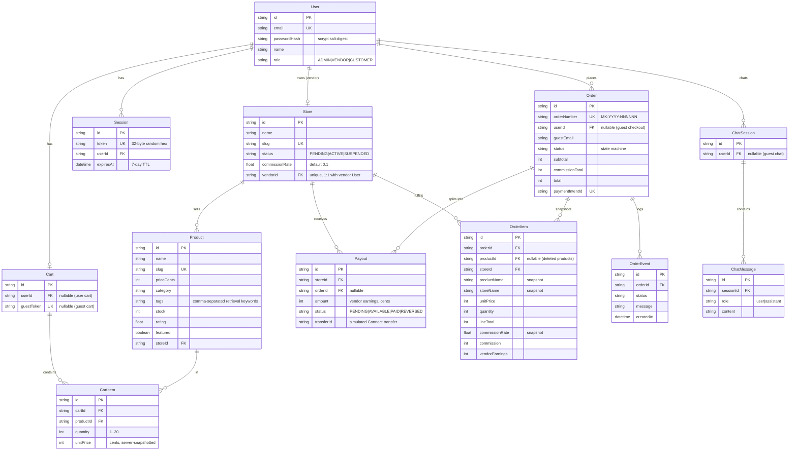
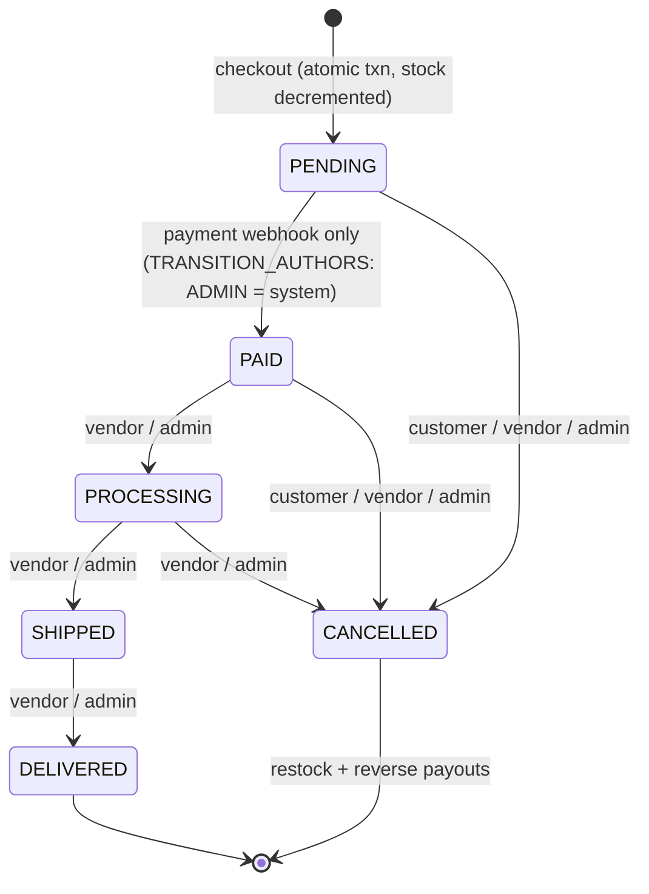

# Meridian Market — Multi-Vendor AI-Enhanced Marketplace

**Next.js 16 (App Router) · TypeScript strict · Tailwind CSS 4 + shadcn/ui · Prisma (SQLite sandbox / Postgres-ready) · Zustand · TanStack Query · socket.io mini-service · z-ai-web-dev-sdk LLM · Simulated Stripe Connect with HMAC-verified webhooks**

A full-stack, production-shaped marketplace: multiple vendors sell through one storefront, the platform takes a 10% commission on every line, and an AI shopping assistant answers natural-language questions against the live catalog. Every subsystem — auth, payments, realtime, caching, rate limiting — is built the way a real deployment would be, with the simulated parts faithfully mirroring their production contracts.

---

## Features

- **RBAC authentication with 3 roles** — `ADMIN` / `VENDOR` / `CUSTOMER`; scrypt password hashing (16-byte per-user salt, 64-byte derived key, timing-safe comparison) and opaque 32-byte session tokens stored in the DB, delivered as an httpOnly `SameSite=Lax` cookie with a 7-day TTL. API surface is intentionally shaped like Auth.js for a drop-in migration.
- **Vendor onboarding + admin approval workflow** — sign-up creates a store in `PENDING` status; products only become publicly visible once an admin approves the store (`PATCH /api/stores/:id`). Admins can also suspend stores and tune per-store commission (0–50%, default 10%).
- **Product CRUD** — vendors manage only their own catalog (`NOT_OWNER` enforcement); admins manage any store via `?storeSlug=`. Public catalog search supports query, category, price range, featured filter, five sort modes and pagination, behind a 10-second response cache.
- **AI shopping assistant (RAG-lite)** — natural-language product Q&A over the live catalog: budget/keyword extraction, scored retrieval (name/tags/category/description + rating and featured boosts) over ACTIVE stores, context-injected LLM call via `z-ai-web-dev-sdk`, full chat persistence, and a deterministic fallback reply when the LLM is unavailable (`degraded` flag surfaced to the UI).
- **Persistent guest + user cart with merge-on-login** — guests get an httpOnly 30-day guest-token cart; on login the guest cart is merged into the user cart inside a transaction (quantities summed, capped to stock and 20 per line) and the guest row deleted. Prices are snapshotted server-side — never trusted from the client.
- **Checkout with simulated Stripe Connect split payments** — one interactive Prisma transaction creates the `PENDING` order with fully snapshotted line items, decrements stock and clears the cart; the capture step computes per-store commission splits (10% platform cut) and issues one Connect "transfer" per store with `Payout` rows. The order number format is `MK-<year>-<000000>`.
- **Signed webhooks** — the checkout flow delivers a `payment_intent.succeeded` webhook **to this app's own endpoint**, signed `t=<ts>,v1=<HMAC-SHA256>` over `<ts>.<payload>`, verified with timing-safe comparison and a 5-minute replay window *before* the body is parsed. Only the webhook flips an order to `PAID` and payouts to `AVAILABLE` (a direct-settlement fallback exists if self-delivery fails).
- **Realtime vendor order feeds via socket.io rooms** — a small dedicated service (engine.io owns `/` on :3003) pushes `order:new`, `order:status` and `payout:update` events to per-user, per-store and admin rooms. Room joins are authorized by a 60-second HMAC ticket minted by `GET /api/realtime/ticket`; the Next.js backend broadcasts through an internal control plane on :3004 guarded by a shared secret.
- **Rate limiting** — per-IP, per-route, per-method windowed counters on every `withApi` route (real numbers in the [security section](#security)); `429` responses carry `Retry-After` and `X-RateLimit-*` headers.
- **CSRF / same-origin protection** — all mutating verbs enforce an `Origin`-vs-`Host` equality check (`403 CSRF_REJECTED`), layered on top of `SameSite=Lax` cookies and a JS-readable double-submit CSRF cookie.
- **In-memory TTL caching as a Redis swap point** — a ~40-line cache behind a narrow interface (`cacheGet` / `cacheSet` / `cacheInvalidatePrefix` / `cached`); swapping in Redis touches no call sites. Same pattern for the rate limiter.

## Architecture

```mermaid
flowchart LR
    subgraph Client["Browser — single-route SPA at /"]
        UI["React UI<br/>Zustand + TanStack Query"]
        WS["socket.io client"]
    end

    subgraph Next["Next.js 16 App Router — :3000"]
        API["API routes (withApi pipeline:<br/>rate limit → CSRF → session → RBAC)"]
        PRISMA["Prisma Client"]
    end

    DB[("SQLite<br/>db/custom.db<br/>(Postgres-ready schema)")]

    LLM["z-ai-web-dev-sdk<br/>LLM chat completions"]

    subgraph RT["mini-services/realtime"]
        CP["Control plane — :3004<br/>POST /emit + x-realtime-secret"]
        IO["socket.io — :3003, path /<br/>rooms: user:* store:* admin"]
    end

    STRIPE["Simulated Stripe Connect<br/>PaymentIntent + per-store transfers<br/>10% platform commission"]

    UI -->|fetch /api/*| API
    API --> PRISMA --> DB
    API -->|RAG-lite catalog context| LLM
    API -->|emitRealtime (fire-and-forget)| CP --> IO
    IO -->|order:new / order:status / payout:update| WS --> UI
    UI -->|GET /api/realtime/ticket<br/>60s HMAC ticket| API
    API -->|capture + computeSplits| STRIPE
    STRIPE --->|self-delivered webhook<br/>stripe-signature HMAC| API
```

## Data model



## Order lifecycle

Enforced by the `ORDER_TRANSITIONS` state machine in `src/lib/constants.ts` and the `PATCH /api/orders/:id` route. Every transition appends an `OrderEvent` and broadcasts a realtime `order:status` event. Cancellation restocks inventory and reverses `PENDING`/`AVAILABLE` payouts to `REVERSED`.



`PAID` is settable **only** through the payment webhook path (`TRANSITION_AUTHORS.PAID = ["ADMIN"]`, interpreted as the payment system); no human-facing route may mark an order paid.

## Local setup

Prerequisites: [Bun](https://bun.sh) 1.2+.

```bash
# 1. Install dependencies
bun install

# 2. Configure environment (defaults already work for local dev)
cp .env.example .env

# 3. Create the SQLite database and generate the Prisma client
bun run db:push

# 4. Seed demo users, stores (12 products, 1 pending store) — idempotent
bun prisma/seed.ts

# 5. Start the marketplace on http://localhost:3000
bun run dev

# 6. In a second terminal, start the realtime mini-service (socket.io :3003, control plane :3004)
cd mini-services/realtime && bun run dev
```

The realtime service is optional at runtime — the API marks it fire-and-forget and the UI degrades gracefully — but the vendor order feed and admin live stats require it.

## Demo accounts

Seeded by `prisma/seed.ts` (development credentials only).

| Email | Password | Role | Store | Notes |
| --- | --- | --- | --- | --- |
| `admin@meridian.dev` | `Admin123!` | ADMIN | — | Platform console: GMV, commission, store approval, payout ledger |
| `velocity@meridian.dev` | `Vendor123!` | VENDOR | Velocity Athletics (ACTIVE) | 4 products |
| `nordic@meridian.dev` | `Vendor123!` | VENDOR | Nordic Audio Lab (ACTIVE) | 3 products |
| `terra@meridian.dev` | `Vendor123!` | VENDOR | Terra Home Goods (ACTIVE) | 3 products |
| `pixelforge@meridian.dev` | `Vendor123!` | VENDOR | Pixel Forge Studio (**PENDING**) | Intentionally pending to demo admin approval |
| `casey@meridian.dev` | `Customer123!` | CUSTOMER | — | Shopper |

Sign in as `admin@meridian.dev` and open the admin console to approve Pixel Forge Studio, then watch its two products appear in the public catalog (the product cache invalidates on store moderation).

## API surface

All routes run through the `withApi` middleware pipeline (rate limit → same-origin check on mutations → session → RBAC) except the webhook and health endpoints. Rate limits below are requests **per minute, per IP, per route**.

| Method | Path | Auth | Rate limit | Purpose |
| --- | --- | --- | --- | --- |
| GET | `/api/health` | none | — | Liveness probe (`SELECT 1`; 503 when DB down) |
| POST | `/api/auth/signup` | public | 10/min | Create CUSTOMER or VENDOR; vendor stores start PENDING |
| POST | `/api/auth/login` | public | 10/min | Sign in; merges guest cart into user cart |
| GET | `/api/auth/me` | public | 120/min | Current user + cart count; issues CSRF cookie |
| POST | `/api/auth/logout` | public | 20/min | Destroy session (DB + cookie) |
| GET | `/api/products` | public | 120/min | Search / filter / sort / paginate ACTIVE-store catalog (10s cache) |
| POST | `/api/products` | VENDOR, ADMIN | 30/min | Create product (admins pass `?storeSlug=`) |
| GET | `/api/products/:id` | public | 120/min | Product detail (404 for non-ACTIVE stores) |
| PATCH | `/api/products/:id` | VENDOR (owner), ADMIN | 60/min | Partial update |
| DELETE | `/api/products/:id` | VENDOR (owner), ADMIN | 30/min | Delete; removes from carts, keeps order snapshots |
| GET | `/api/cart` | public (guest cookie or session) | 120/min | Cart with server-side prices, subtotal, count |
| POST | `/api/cart` | public | 90/min | Add / increment item (stock- and 20-cap enforced) |
| PATCH | `/api/cart` | public | 90/min | Set quantity (`0` removes) |
| DELETE | `/api/cart` | public | 60/min | Remove one (`?productId=`) or clear the cart |
| POST | `/api/checkout` | public (guests supply email) | 8/min | Atomic order + splits + self-delivered signed webhook |
| GET | `/api/orders` | signed-in | 60/min | CUSTOMER: own · VENDOR: participant · ADMIN: all (last 50) |
| GET | `/api/orders/:id` | owner / vendor participant / admin | 60/min | Order detail + event timeline (vendor items scoped) |
| PATCH | `/api/orders/:id` | signed-in + authorship rules | 60/min | State-machine transitions (see above) |
| GET | `/api/stores` | public | 60/min | ACTIVE store directory (`?all=1` for admins) |
| POST | `/api/stores` | VENDOR (without a store) | 10/min | Create store (PENDING) |
| PATCH | `/api/stores/:id` | ADMIN | 30/min | Approve / suspend / set commission rate |
| GET | `/api/admin/stats` | ADMIN | 60/min | GMV, commission, order pipeline, store leaderboard, payouts (5s cache) |
| GET | `/api/realtime/ticket` | signed-in | 30/min | 60s HMAC ticket authorizing socket.io room joins |
| POST | `/api/webhooks/stripe` | HMAC signature (no cookie auth) | — | Verify signature on raw body → settle `payment_intent.succeeded` / `transfer.created`, idempotently |

`GET /api` is the scaffold ping and can be removed.

## Security

- **Password storage** — scrypt (`scryptSync`, 16-byte random hex salt, 64-byte derived key) stored as `scrypt:<salt>:<digest>`; verification is length-checked and `timingSafeEqual`. Login failures return a uniform `Invalid email or password.` — no user-enumeration oracle.
- **Sessions** — 32-byte random opaque tokens in the `Session` table (never JWTs, nothing decodable client-side), sent as `mk_session` httpOnly / `SameSite=Lax` / `Secure`-in-production cookies, 7-day TTL with opportunistic cleanup of expired rows. The session table doubles as a revoke-everywhere primitive.
- **RBAC** — every `withApi` route declares required roles (`roles: []` = any authenticated user); `withApi` rejects unauthenticated callers with 401 and wrong-role callers with 403 before the handler runs. Object-level checks (own product, participant order, own store) are enforced inside handlers.
- **Rate limiting** — windowed per-IP counters keyed `ip:path:method` with opportunistic sweeping. Actual configured limits (per minute): login 10, signup 10, checkout **8**, AI chat **15**, product writes 30–60, cart writes 60–90, reads 60–120. Exceeding returns `429` with `Retry-After`, `X-RateLimit-Limit`, `X-RateLimit-Reset`.
- **CSRF / same-origin** — every non-`GET/HEAD/OPTIONS` request must carry an `Origin` whose host equals the request `Host` (403 `CSRF_REJECTED` otherwise), on top of `SameSite=Lax` cookies; `GET /api/auth/me` additionally seeds a JS-readable `mk_csrf` double-submit cookie (24h).
- **Webhook verification** — `stripe-signature` parsed as `t=<ts>,v1=<mac>`; the HMAC-SHA256 is computed over `<ts>.<raw body>` and compared with `timingSafeEqual`; timestamps outside the **5-minute replay window** are rejected before JSON parsing. Event handling is idempotent (replaying a settled intent is a no-op).
- **Realtime ticket auth** — browsers cannot self-declare rooms. The SPA fetches a 60-second HMAC-SHA256 ticket (`{sub, role, storeId, exp}`, signed with `AUTH_SECRET`); the socket service verifies it and derives the allowed room set (`user:<id>`, plus `store:<id>` for vendors or `admin` for admins). The emit control plane on :3004 is bound to `127.0.0.1` and requires the shared `REALTIME_SECRET` header, with a 1 MB body guard.
- **Input sanitization** — every mutating route parses through Zod (`src/lib/validation.ts`): strings trimmed and length-capped, closed literal-union enums, integer cents bounds (`$0.50–$100,000`), quantity caps; parsed output is the only thing that reaches Prisma. Zod failures become structured `422 VALIDATION_ERROR` envelopes.
- **Money integrity** — integer cents end-to-end; floating point never touches stored money; the single rounding point is `computeLineSplit` (round-half-up on the per-line commission).
- **Security headers** — cookie-level protections (`httpOnly`, `SameSite`, `Secure` in production) are set by the app; transport and framing headers (`HSTS`, `X-Content-Type-Options`, `X-Frame-Options`/`frame-ancestors`, a CSP suited to the single-route SPA) are enforced at the edge — set them on the hosting proxy/CDN (or a Next.js `middleware.ts`/`next.config.ts` `headers()` block) where TLS terminates. (Note: `X-Frame-Options`/`frame-ancestors` is intentionally absent in this sandbox build so the platform preview can iframe the app — add it for any public deployment.)

## Testing strategy

Per repository policy, this sandbox build ships **without test files**. The suite below is the recommended layout for the production fork — pure functions (`money`, `rate-limit`, `payments`, `constants`) are fully unit-testable with no mocks, which is precisely why they were extracted.

```text
tests/
  unit/
    money.test.ts
    rate-limit.test.ts
    payments.test.ts        # signature verify + replay rejection
    order-machine.test.ts   # ORDER_TRANSITIONS / TRANSITION_AUTHORS table
    ai-retrieval.test.ts    # tokenize, budget extraction, scoring
  integration/
    checkout.test.ts        # route handler + real SQLite (transaction, stock, splits)
    cart-merge.test.ts
    orders-api.test.ts
  e2e/
    guest-checkout.spec.ts  # Playwright
    vendor-realtime.spec.ts
```

- **Unit (vitest)** — `money.test.ts`: "rounds commission half-up per line", "never loses a cent: commission + vendorEarnings === lineTotal", "rejects non-integer cents". `rate-limit.test.ts`: "allows exactly N requests then 429s", "resets after the window elapses", "sweeps expired windows". `payments.test.ts`: "accepts a correctly signed payload", "rejects a tampered body", "rejects a signature older than 5 minutes (replay window)", "rejects a malformed header". `order-machine.test.ts`: "permits only ORDER_TRANSITIONS[from] targets", "PAID has no human authors", "CANCELLED is terminal".
- **Integration (vitest + a throwaway SQLite file)** — `checkout.test.ts`: "creates order + items + event and decrements stock atomically", "snapshots prices at checkout time", "rejects checkout when stock is insufficient (409)", "flips order to PAID only via the webhook", "marks payouts AVAILABLE after settlement". `cart-merge.test.ts`: "sums quantities across guest and user carts, caps to stock and 20", "deletes the guest cart after merge", "keeps a server-side unit price".
- **E2E (Playwright against `bun run dev` + realtime service)** — `guest-checkout.spec.ts`: "guest adds to cart, checks out with email, sees order confirmation"; `vendor-realtime.spec.ts`: "vendor receives order:new in the store room within 2s of checkout"; "admin approves PENDING store and products appear in catalog".

## Deployment

### Vercel (app) + managed Postgres + hosted realtime

1. Push to GitHub; import the repo in Vercel (framework auto-detected; `output: "standalone"` is already configured in `next.config.ts`).
2. Provision Postgres (Neon/Supabase/RDS), set `provider = "postgresql"` in `prisma/schema.prisma` and convert the `String` unions to `enum` blocks — the only schema change required.
3. Set environment variables (see `.env.example`):

   | Variable | Purpose |
   | --- | --- |
   | `DATABASE_URL` | Postgres connection string (SQLite `file:` path in sandbox) |
   | `AUTH_SECRET` | Signs realtime tickets; shared with the realtime service |
   | `REALTIME_SECRET` | Shared secret on the emit control plane (`x-realtime-secret`) |
   | `STRIPE_WEBHOOK_SECRET` | HMAC key for webhook signature verification |
   | `REALTIME_INTERNAL_URL` | Control-plane base the API POSTs emits to (default `http://127.0.0.1:3004`) |
   | `INTERNAL_API_BASE` | Where checkout self-delivers the signed webhook (default `http://127.0.0.1:3000`) |
   | `NEXT_PUBLIC_APP_NAME` | Display name exposed to the client |

4. Run `prisma migrate deploy` + seed during release, then deploy the realtime mini-service to any long-lived host (Fly.io / Railway / ECS; it is a plain Bun process) and point `REALTIME_INTERNAL_URL` at it.

### Docker / docker-compose (single host)

```bash
cp .env.example .env          # fill real secrets
docker compose up --build     # migrate → app (:3000) + realtime (:3003/:3004)
```

`docker-compose.yml` runs a one-shot `migrate` service (`prisma db push` + seed), then the multi-stage-built app (non-root, standalone Next.js server) and the realtime service, with a named volume for the SQLite file and a `/api/health` healthcheck.

### Swapping in real Stripe Connect

The simulated engine intentionally reproduces the production contract, so the swap is small and contained in `src/lib/payments.ts`:

1. Replace the internals of `createPaymentIntent` / `captureWithSplits` with real `stripe` SDK calls — PaymentIntents with `application_fee_amount` and `transfer_data.destination` (destination charges) or separate charges and transfers, whichever matches the onboarding state of your connected accounts. Keep the exported signatures.
2. **Keep `verifyWebhookSignature` exactly as is** — it mirrors Stripe's `constructEvent` (same header format, same timestamp tolerance); only the secret changes.
3. In the Stripe dashboard create a *restricted* webhook endpoint for `payment_intent.succeeded` and `transfer.created` pointing at `/api/webhooks/stripe`, copy its signing secret into `STRIPE_WEBHOOK_SECRET`, and delete the self-delivery block in `POST /api/checkout` (real webhooks arrive from Stripe instead).
4. Onboard vendors with Connect Express accounts; map `Payout.transferId` to real transfer IDs and drive `PENDING → AVAILABLE → PAID` from `transfer.created` events.
5. Re-run the webhook unit tests — they assert the verifier contract, not the simulator, and must pass unchanged against the real secret format (`whsec_...`).

## Repository layout

```text
prisma/schema.prisma        12-model schema, integer-cents money, indexed FKs
prisma/seed.ts              idempotent demo dataset (6 users, 4 stores, 12 products)
src/lib/                    api pipeline, auth, payments, ai, cart, money, cache,
                            rate-limit, realtime, validation, constants
src/app/api/                route handlers (see API surface above)
mini-services/realtime/     socket.io service (:3003) + control plane (:3004)
public/products/            generated product imagery
Dockerfile / docker-compose.yml / .github/workflows/ci.yml
DECISIONS.md                ADR-style record of the 12 core design decisions
```
