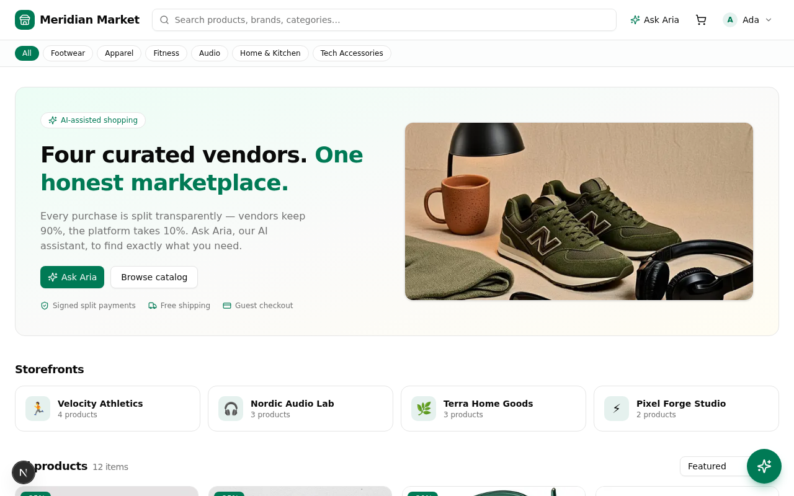
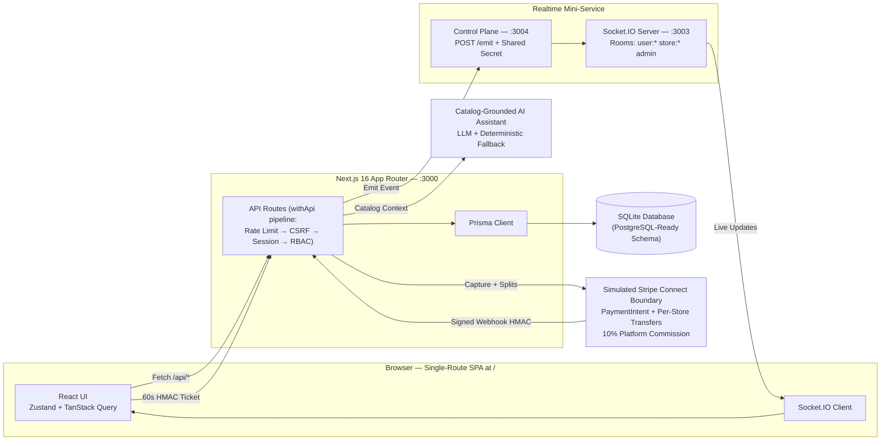
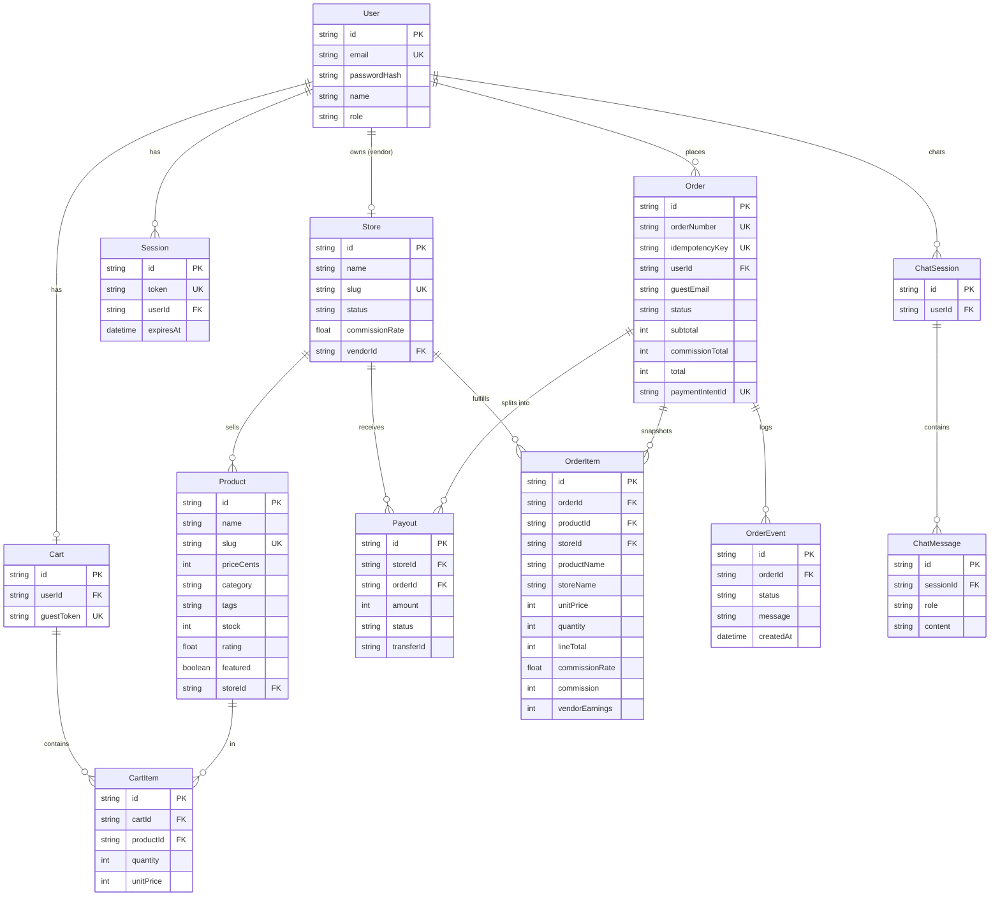
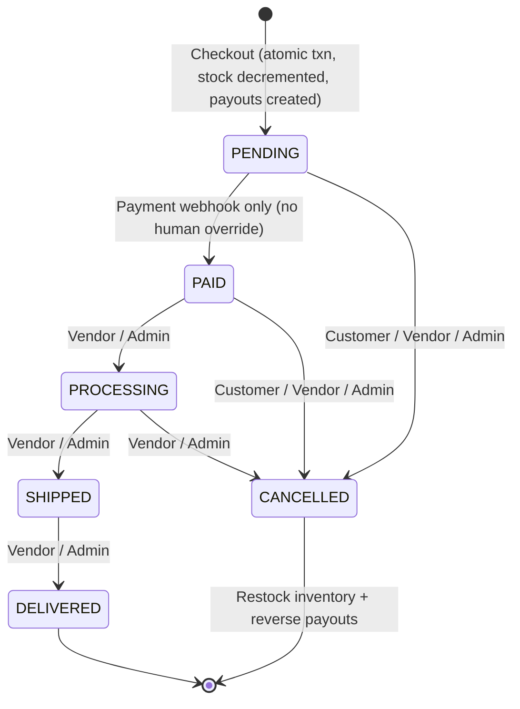

# Meridian Market — Multi-Vendor AI-Enhanced Marketplace

**Next.js 16 (App Router) · TypeScript Strict · Tailwind CSS 4 · Prisma (SQLite Sandbox / PostgreSQL-Ready) · Zustand · TanStack Query · Socket.IO Realtime Service · Catalog-Grounded AI Assistant · Simulated Stripe Connect with HMAC Webhooks**

Meridian Market is a production-shaped multi-vendor marketplace prototype built with Next.js, TypeScript, Prisma, SQLite, realtime Socket.IO infrastructure, a catalog-grounded AI assistant, and a simulated Stripe Connect payment boundary.

---

## Why I Built This

I built Meridian Market to explore the architectural and transactional challenges inherent to multi-vendor commerce platforms:

1. **Transactional Commerce & Concurrency**: Multi-vendor checkouts involve coordinating inventory reservation across multiple independent stores, creating immutable order item snapshots, computing platform commissions, and recording vendor payouts. Handling these operations safely requires interactive transactions with conditional database-level stock decrements to eliminate time-of-check to time-of-use (TOCTOU) race conditions.
2. **Network Retries & Idempotency**: Distributed clients frequently retry requests due to network timeouts. I implemented database-backed idempotency keys on the checkout surface to ensure that duplicate requests return the existing order without duplicate charges, re-decrementing inventory, or creating orphan payouts.
3. **Financial State Machine & Security Boundaries**: Payment state (`PAID`) represents a verified financial event, not an administrative opinion. The order lifecycle state machine restricts the `PAID` transition exclusively to verified payment webhooks, blocking manual administrative overrides while allowing legitimate downstream order fulfillment.
4. **Reliable Webhook Verification**: The payment boundary verifies timing-safe HMAC-SHA256 signatures on raw request payloads with a 5-minute replay window before parsing JSON, matching production payment gateway contracts.
5. **Grounded AI Assistant with Deterministic Fallback**: The shopping assistant uses catalog extraction and attribute scoring over active store inventory. When external LLM credentials or services are unavailable, it degrades gracefully to deterministic catalog-grounded recommendations rather than failing silently.

---

## Key Engineering Decisions

* **Integer Cents Money Integrity**: Floating-point math is never used for stored financial values. All amounts are stored as integer cents ($10.00 = 1000). The single rounding point in the entire codebase is half-up rounding on line-item commission calculation (`computeLineSplit`), guaranteeing that platform commission plus vendor earnings always equals the line total.
* **Cryptographically Generated, Collision-Resistant Order Numbers**: Replaced sequential table count queries with `MK-<YYYY>-<8 HEX CHARS>` using standard library `node:crypto.randomBytes(4)`. This avoids lock contention and eliminates race conditions under high concurrent checkout volume while providing over $4.29 \times 10^9$ unique combinations per calendar year.
* **Atomic Conditional Stock Allocation**: Inventory decrements execute inside the Prisma `$transaction` using conditional updates (`WHERE id = ? AND stock >= ?`). If any item's stock is insufficient at the exact moment of decrement, the count check aborts and rolls back the entire transaction, leaving inventory and cart state intact.
* **Webhook-Controlled PAID State**: The state machine table (`TRANSITION_AUTHORS.PAID = []`) explicitly reserves the `PAID` transition for the webhook handler. No human user role—including platform administrators—can manually patch an order to `PAID`.
* **Portable SQLite Sandbox to PostgreSQL Architecture**: Built locally on SQLite for zero-dependency development, but modeled with strict relational constraints, indexed foreign keys, and integer cents representations that map directly to PostgreSQL in production.

---

## Visual Preview

<div align="center">
  
  <p><em>Curated multi-vendor storefront with catalog filtering and AI shopping assistant</em></p>
</div>

---

## Architecture



---

## Data Model



---

## Order Lifecycle State Machine

Enforced by `ORDER_TRANSITIONS` and `TRANSITION_AUTHORS` in `src/lib/constants.ts` and the `PATCH /api/orders/:id` endpoint. Every state transition writes an immutable `OrderEvent` audit log and broadcasts a realtime update.



---

## Security & Protection Layers

* **Password Security**: Derived using `scryptSync` (16-byte random salt, 64-byte key) formatted as `scrypt:<salt>:<digest>`, compared with `timingSafeEqual` to avoid timing attacks.
* **Session Management**: Opaque 32-byte random hex tokens stored in the `Session` database table and delivered via httpOnly, `SameSite=Lax` cookies with a 7-day TTL.
* **Layered CSRF & Origin Verification**: Mutating HTTP requests verify a double-submit CSRF cookie (`mk_csrf`) against the `x-csrf-token` header using timing-safe comparison, paired with Fetch Metadata (`Sec-Fetch-Site: cross-site` rejection).
* **Sliding-Window Rate Limiting**: Per-IP, per-route sliding window counters configured across the API surface (e.g., login: 10/min, checkout: 8/min, AI chat: 15/min, catalog reads: 120/min).
* **Webhook Replay Protection**: `stripe-signature` parsed as `t=<timestamp>,v1=<signature>`. The HMAC-SHA256 is verified over `<timestamp>.<raw body>` with `timingSafeEqual`, enforcing a strict 5-minute timestamp tolerance window.

---

## Testing & Verification

Automated testing is powered by **Vitest** against an isolated throwaway SQLite database created fresh per test run via Prisma (`tests/global-setup.ts`). Tests run against real Next.js route handlers through the full `withApi` middleware pipeline without external network dependencies.

```text
75 / 75 tests passing across 7 test suites:

Unit Suites (28 tests):
  ✓ tests/unit/money.test.ts          (8 tests)   - Half-up rounding, cent conservation, split calculations
  ✓ tests/unit/order-machine.test.ts  (9 tests)   - Legal state transitions, terminal states, PAID webhook monopoly
  ✓ tests/unit/payments.test.ts       (11 tests)  - HMAC signature verification, replay window, payload tampering

Integration Suites (47 tests):
  ✓ tests/integration/checkout.test.ts      (12 tests)  - Atomic reservation, stock rollback, idempotency, random order numbers
  ✓ tests/integration/auth-rbac.test.ts     (15 tests)  - Role authorization, IDOR boundaries, vendor isolation, admin PAID block
  ✓ tests/integration/webhook.test.ts       (11 tests)  - Signed webhook settlement, idempotent replay, unsigned payload rejection
  ✓ tests/integration/ai-assistant.test.ts  (9 tests)   - Budget parsing, active store retrieval, deterministic offline fallback
```

---

## Local Setup

### Prerequisites
* [Bun](https://bun.sh) 1.2+ (or Node.js 20+)

### Quickstart

```bash
# 1. Install dependencies
bun install

# 2. Configure environment variables
cp .env.example .env

# 3. Initialize the SQLite database and generate Prisma Client
bun run db:push

# 4. Seed demo accounts, stores, and catalog products
bun prisma/seed.ts

# 5. Start Next.js development server (http://localhost:3000)
bun run dev

# 6. (Optional) In a separate terminal, start the realtime mini-service
cd mini-services/realtime && bun run dev
```

### Running Tests & Quality Checks

```bash
# Run the complete test suite (75 tests)
npm test

# Run ESLint check
npm run lint

# Run TypeScript typecheck
npx tsc --noEmit

# Run Next.js production build
npm run build
```

---

## Demo Accounts

The database seed (`prisma/seed.ts`) provisions the following development accounts:

| Email | Password | Role | Store | Purpose |
|---|---|---|---|---|
| `admin@meridian.dev` | `Admin123!` | `ADMIN` | — | Platform moderation, store approval, payout ledger |
| `velocity@meridian.dev` | `Vendor123!` | `VENDOR` | Velocity Athletics (ACTIVE) | Footwear & athletics vendor (4 products) |
| `nordic@meridian.dev` | `Vendor123!` | `VENDOR` | Nordic Audio Lab (ACTIVE) | Premium audio equipment (3 products) |
| `terra@meridian.dev` | `Vendor123!` | `VENDOR` | Terra Home Goods (ACTIVE) | Home & kitchen goods (3 products) |
| `pixelforge@meridian.dev` | `Vendor123!` | `VENDOR` | Pixel Forge Studio (**PENDING**) | Demonstrates store approval workflow |
| `casey@meridian.dev` | `Customer123!` | `CUSTOMER` | — | Standard shopper account |

---

## Known Limitations & Production Path

* **Database Engine**: Uses local SQLite for instant setup. The Prisma schema is structured for PostgreSQL migration by updating the `provider` in `prisma/schema.prisma` and configuring a PostgreSQL connection string.
* **Cache & Rate Limiting Storage**: Uses in-memory sliding window counters and TTL stores, architected behind narrow interfaces (`src/lib/cache.ts`, `src/lib/rate-limit.ts`) as direct swap points for Redis in multi-instance deployments (see `DECISIONS.md` ADR #8).
* **Payment Gateway**: Features a fully modeled Stripe Connect destination-charge simulation with real HMAC webhook verification. Swapping to production Stripe involves replacing `src/lib/payments.ts` methods with the official Stripe SDK while keeping the webhook verification signature contract intact (see `DECISIONS.md` ADR #4).
